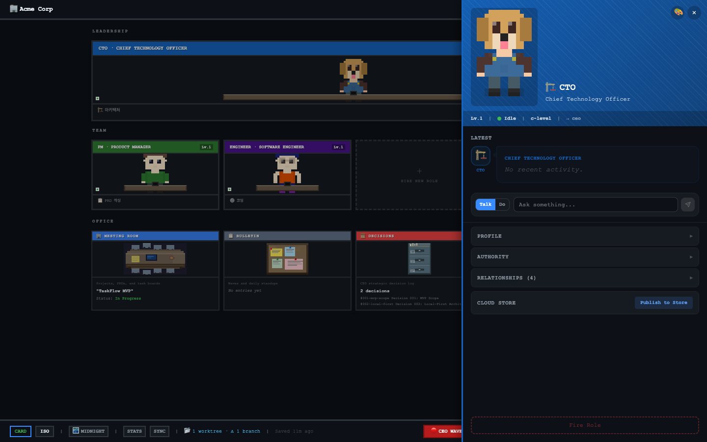

<p align="center">
  
</p>

<h1 align="center">tycono</h1>

<p align="center">
  <strong>Build an AI company. Watch them work.</strong>
</p>

<p align="center">
  <a href="https://www.npmjs.com/package/tycono"></a>
  <a href="https://github.com/seongsu-kang/tycono/blob/main/LICENSE"></a>
  <a href="https://www.npmjs.com/package/tycono"></a>
</p>

<p align="center">
  <a href="https://tycono.ai">Website</a> &middot;
  <a href="#quick-start">Quick Start</a> &middot;
  <a href="#how-it-works">How It Works</a> &middot;
  <a href="CONTRIBUTING.md">Contributing</a>
</p>

---

**tycono** is an open-source platform that lets you create and run an AI-powered organization. Define roles (CTO, PM, Engineer...), assign them AI agents, and watch them collaborate through a real-time dashboard.

## Quick Start

```bash
mkdir my-company && cd my-company
npx tycono
```

That's it. A setup wizard guides you through creating your company, then your browser opens to a live dashboard showing your AI team at work.

## Why Tycono?

| | Single AI Agent | Tycono |
|---|---|---|
| **Structure** | One agent, one context | Multiple roles with org hierarchy |
| **Knowledge** | Loses context between sessions | Persistent, file-based knowledge system (AKB) |
| **Authority** | Can do anything | Scoped — each role has boundaries |
| **Delegation** | Manual prompt chaining | Automatic dispatch through org chart |
| **Visibility** | Terminal output | Real-time isometric office dashboard |

## What You Get

- **Role-based AI agents** — Each role has its own persona, authority scope, and knowledge boundaries
- **Org hierarchy** — Roles report to each other. CTO dispatches to Engineers. PM coordinates with Design.
- **Real-time dashboard** — Watch your AI team work in an isometric pixel-art office
- **Knowledge management** — Automatic document routing, cross-linking, and Hub-based organization
- **Local-first** — Everything runs on your machine. Your data stays yours.
- **BYOK** — Bring your own Anthropic API key. No middleman.

<p align="center">
  
</p>

## Requirements

- Node.js >= 18
- [Anthropic API key](https://console.anthropic.com/)

## Team Templates

During setup, pick a template or build your own:

| Template | Roles | Best For |
|----------|-------|----------|
| **Startup** | CTO + PM + Engineer | Product development |
| **Research** | Lead Researcher + Analyst + Writer | Analysis & reports |
| **Agency** | Creative Director + Designer + Developer | Client projects |
| **Custom** | Start empty, hire as you go | Full control |

## How It Works

```
You (CEO)
  └── Give instructions via dashboard
        └── Context Engine routes to the right Role
              └── Role reads its knowledge, executes with authority
                    └── Results flow back up the org chart
```

Every role has:
- `role.yaml` — Identity, authority, knowledge scope
- `SKILL.md` — Tools and capabilities
- `profile.md` — Public-facing description
- `journal/` — Work history

## Your Company Structure

```
your-company/
├── CLAUDE.md           ← AI entry point (auto-managed)
├── company/            ← Mission, vision, values
├── roles/              ← AI role definitions
├── projects/           ← Product specs and tasks
├── architecture/       ← Technical decisions
├── operations/         ← Standups, decisions, waves
├── knowledge/          ← Domain knowledge
└── .tycono/            ← Config and preferences
```

## CLI Usage

```bash
npx tycono              # Start server + open dashboard
npx tycono --help       # Show help
npx tycono --version    # Show version
```

## Environment Variables

| Variable | Description | Default |
|----------|-------------|---------|
| `ANTHROPIC_API_KEY` | Your Anthropic API key | — |
| `PORT` | Server port | auto-detect |
| `COMPANY_ROOT` | Company directory | current directory |

## Development

```bash
git clone https://github.com/seongsu-kang/tycono.git
cd tycono
npm install
cd src/api && npm install && cd ../..
cd src/web && npm install && cd ../..

# Dev mode (hot reload)
npm run dev

# Type check
npm run typecheck
```

## Contributing

See [CONTRIBUTING.md](CONTRIBUTING.md) for guidelines.

## Get Help

- [GitHub Issues](https://github.com/seongsu-kang/tycono/issues) — Bug reports and feature requests
- [GitHub Discussions](https://github.com/seongsu-kang/tycono/discussions) — Questions and ideas

## License

[MIT](LICENSE)

---

<p align="center">
  <sub>Built with tycono. An AI company that builds itself.</sub>
</p>
