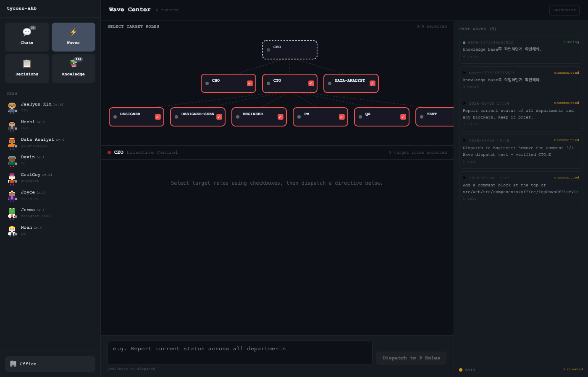
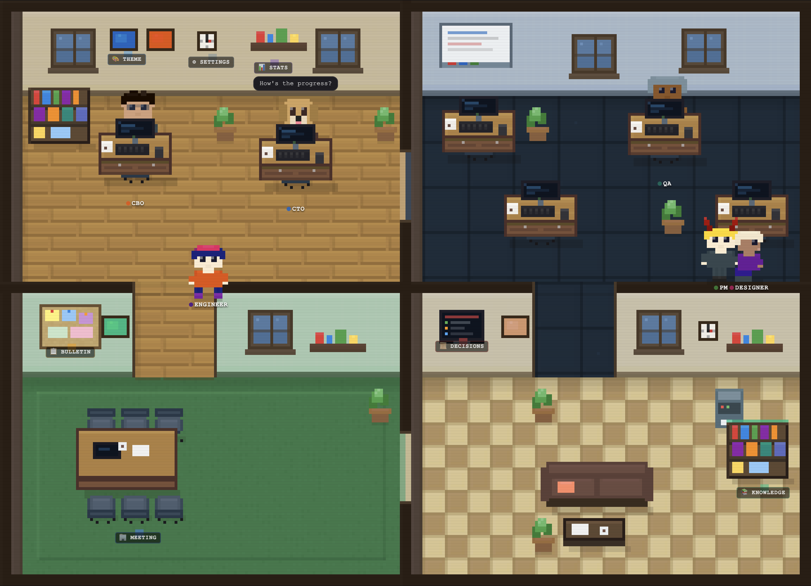

# tycono

**Your company, in code.**

Define your org. Give one order. Your AI team plans, builds, and learns — and they remember everything next time.

Terminal-native. Local-first. Open source.

<p align="center">
  <a href="https://www.npmjs.com/package/tycono"></a>
  <a href="https://www.npmjs.com/package/tycono-server"></a>
  <a href="https://github.com/seongsu-kang/tycono/blob/main/LICENSE"></a>
</p>

<p align="center">
  
</p>

---

## Quick Start

### Claude Code Plugin (Recommended)

```bash
claude plugin install tycono
```

```
You: /tycono "Build a landing page for my SaaS"

CEO  → Breaks it down, dispatches CTO
CTO  → Plans architecture, dispatches Engineer
Engineer → Writes code
QA   → Reviews and tests
CEO  → Approves final result
```

### Terminal (TUI)

```bash
npx tycono
```

A setup wizard walks you through naming your company, picking a team, and starting your first wave.

---

## Company-as-Code

Terraform turns `.tf` files into running infrastructure.
Tycono turns YAML and Markdown into a running company.

```yaml
# roles/engineer/role.yaml
id: engineer
name: "Alex"
level: member
reports_to: cto
model: claude-sonnet-4

authority:
  autonomous: ["Code implementation", "Bug fixes"]
  requires_approval: ["Architecture changes"]

knowledge_scope:
  readable: ["projects/", "architecture/"]
  writable: ["projects/*/technical/"]
```

One file defines who the agent is, what they can do, what they know, and who they report to.

- **One order, whole org moves.** You tell the CEO what you want. The hierarchy handles the rest.
- **Authority is enforced.** Engineers can't make architecture decisions. PMs can't merge code.
- **Knowledge compounds.** Every session reads what came before and writes back what it learned.

---

## How It Works

```
1. Install     claude plugin install tycono
2. Build team  Guided setup wizard — or pick an agency preset
3. Give order  "Build a tower defense game"
4. Watch       CEO dispatches CTO → Engineer → QA, in real time
5. Learn       Knowledge persists. Next wave starts smarter.
```

---

## Real-World Results

A crypto trading research team ran **13.5 hours of autonomous AI work** — zero human intervention:

| Metric | Value |
|--------|-------|
| Duration | 13.5 hours |
| Agent sessions | 174 |
| Hypotheses tested | 29 |
| Cost | $54 total ($2.5/hypothesis) |
| Critic role | Caught a false-positive before production |

Cost trajectory: $1,342/wave (early beta) → **$4/wave** (current).

---

## Features

| Feature | What it does |
|---------|-------------|
| **Wave Dispatch** | One order cascades through the entire org hierarchy |
| **Auto-Amend** | Follow-up work continues in the same session — 70% cost reduction |
| **Handoff Summary** | Re-dispatched roles get previous session context automatically |
| **Prompt Caching** | Static system prompt sections cached — up to 90% input cost reduction |
| **Critic Role** | Built-in Devil's Advocate that challenges team conclusions |
| **AKB** | File-based knowledge system. Pre-K reads, Post-K writes. Compounds over time. |
| **Heartbeat Watch** | Real-time supervision. Redirect mid-execution if direction drifts. |

---

## Surfaces

| Surface | Status | What |
|---------|--------|------|
| **Plugin** | ✅ Active | Claude Code plugin. Primary entry point. |
| **TUI** | ✅ Active | Terminal dashboard — org tree, agent streams, wave management. |
| **Server** | ✅ Active | Headless API backend. All surfaces consume this. |
| **Pixel** | ❄️ Frozen | Isometric pixel office UI. Kept for demos. |

### Plugin

```bash
claude plugin install tycono
/tycono "Build a landing page"
/tycono --agency gamedev "Build a tower defense"
```

### TUI

```bash
npx tycono
```

```
┌── W1 Build the API ──────┬── Stream ──────────────────────────┐
│  3 sessions               │  cto     → dispatch engineer       │
│  ── Org Tree ──           │  engineer → Write src/api/routes.ts│
│  ● CEO                    │  qa       ▶ Running test suite...  │
│  ├─ ● CTO               │                                     │
│  │  ├─ ● engineer         │                                     │
│  │  └─ ● qa               │                                     │
│  └─ ○ CBO                │                                     │
└───────────────────────────┴─────────────────────────────────────┘
```

### Pixel (Frozen)

Isometric pixel office — watch your AI team walk around and collaborate visually.
Not actively developed. See [tycono.ai](https://tycono.ai) for a preview.

<p align="center">
  
</p>

---

## Agencies

Pre-built team configurations for common workflows.

```bash
/tycono --agency gamedev "Build a browser game"
/tycono --agency startup-mvp "Build an MVP"
/tycono --agency solo-founder "Research and plan my next product"
```

Create custom agencies or browse presets at [tycono.ai/agencies](https://tycono.ai/agencies)

---

## Your Company Structure

When you start Tycono, it scaffolds:

```
your-company/
├── CLAUDE.md             ← AI operating rules
├── roles/                ← Role definitions (role.yaml + skills)
├── projects/             ← Specs, PRDs, tasks
├── architecture/         ← Technical decisions
├── knowledge/            ← Domain knowledge (compounds over time)
└── .tycono/              ← Config
```

---

## CLI Reference

```bash
npx tycono                # Start TUI
npx tycono ./my-company   # Specific directory
npx tycono --classic      # Pixel office (frozen)
npx tycono --attach       # Connect to running server
```

### TUI Commands

```
/new [text]       New wave
/waves            List waves
/focus <n>        Switch wave
/agents           Org tree
/sessions         Session list
/kill <id>        Kill session
/docs             Files from this wave
/read <path>      Preview file
/open <path>      Open in $EDITOR
Tab               Panel mode
/quit             Exit
```

---

## Requirements

- Node.js >= 18
- [Claude Code CLI](https://claude.ai/download) (recommended) or Anthropic API key

---

## Development

```bash
git clone https://github.com/seongsu-kang/tycono.git
cd tycono && npm install
cd src/api && npm install && cd ../..
cd src/web && npm install && cd ../..
npm run dev
```

### Monorepo

```
tycono/
├── packages/
│   ├── server/           ← tycono-server (headless API)
│   ├── plugin/           ← Claude Code Plugin
│   └── web/              ← tycono.ai
├── src/
│   ├── api/              ← Core Engine
│   ├── tui/              ← Terminal UI
│   └── web/              ← Pixel UI (frozen)
└── README.md
```

---

## Links

- [tycono.ai](https://tycono.ai)
- [Agencies](https://tycono.ai/agencies)
- [npm: tycono-server](https://www.npmjs.com/package/tycono-server)
- [GitHub](https://github.com/seongsu-kang/tycono)
- License: [MIT](LICENSE)
