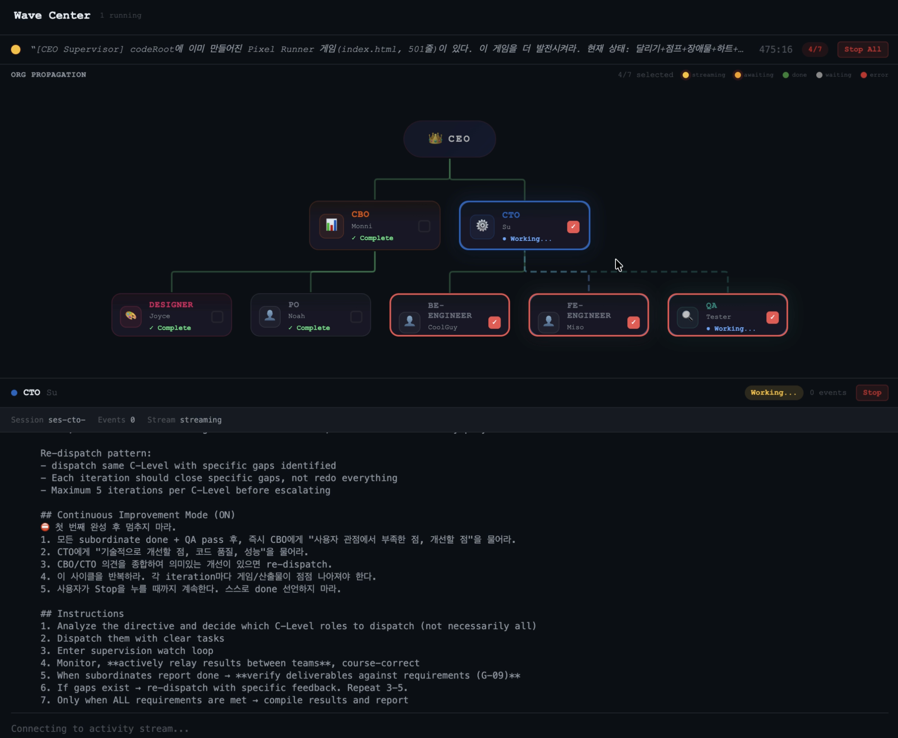

<p align="center">
  
</p>

<h1 align="center">tycono</h1>

<p align="center">
  <strong>Build an AI company. Watch them work.</strong><br>
  <sub>Infrastructure-as-Code defined servers. Company-as-Code defines organizations.</sub>
</p>

<p align="center">
  <a href="https://www.npmjs.com/package/tycono"></a>
  <a href="https://github.com/seongsu-kang/tycono/blob/main/LICENSE"></a>
  <a href="https://www.npmjs.com/package/tycono"></a>
</p>

<p align="center">
  <a href="https://tycono.ai">Website</a> ·
  <a href="#quick-start">Quick Start</a> ·
  <a href="#how-it-works">How It Works</a> ·
  <a href="#company-as-code">Company-as-Code</a> ·
  <a href="CONTRIBUTING.md">Contributing</a>
</p>

---

**tycono** is an open-source platform that lets you define and run an AI-powered organization. Roles, authority, knowledge, and workflows — all defined in files, executed by AI agents, visualized in real time.

One command. Your AI company is running.

```bash
npx tycono
```

## Core Pillars

### 1. CEO Supervisor — Org-chart orchestration

You give one order. The system dispatches through a real hierarchy.

```
dispatch → watch → relay → quality gate → re-dispatch (if needed)
```

CEO delegates to C-levels, C-levels dispatch to their teams. Authority is enforced — engineers can't make CEO decisions, PMs can't merge code. The org chart isn't decoration, it's the execution engine.

<p align="center">
  
</p>

### 2. Observability — See everything, intervene anytime

Your AI team isn't a black box. Watch every agent work in real time, inject directives mid-execution, and drill down to any level.

- **Wave Center** — Org-tree dispatch with real-time streaming
- **Activity Stream** — Every event logged (dispatches, tool calls, decisions)
- **CEO Directive** — Change direction while agents are running
- **Cost Tracking** — Per-role, per-model token breakdown

### 3. Isolation Infrastructure — Agents don't collide

Multiple agents working simultaneously without stepping on each other.

| Resource | Isolation | Status |
|----------|-----------|--------|
| **Code** | Git worktree per session | Designed |
| **Ports** | Dynamic port registry | ✅ Live |
| **Browser** | Separate daemon per session | ✅ Live |
| **Knowledge** | Shared reads, scoped writes | ✅ Live |

### 4. AKB (Pre-K / Post-K) — Knowledge that compounds

Every AI tool today: `Plan → Execute → Done`. Knowledge resets. Tycono adds what the industry doesn't have:

```
Pre-K:  Read existing knowledge → Plan grounded in what the company knows
Execute: Do the work
Post-K: Extract insights → Cross-link → Register in knowledge graph
```

Session 50 is dramatically smarter than session 1. Your company learns.

## Why Tycono?

Coding agents simulate **one developer**. Tycono simulates **the entire company**.

| | Single AI Agent | Tycono |
|---|---|---|
| **What it runs** | One agent, one context | Multiple roles with org hierarchy |
| **Knowledge** | Resets every session | Compounds forever (AKB Pre-K/Post-K) |
| **Authority** | Can do anything (or nothing) | Scoped — each role has clear boundaries |
| **Delegation** | Manual prompt chaining | CEO dispatches, org chart routes automatically |
| **Scale** | 1 agent | 7 → 700 agents |
| **Visibility** | Terminal output | Real-time org tree + activity stream |

## Company-as-Code

Just as Terraform turns `.tf` files into running infrastructure, Tycono turns YAML and Markdown into a running company.

```
IaC                          CaC (Company-as-Code)
─────────────────────        ─────────────────────
.tf         → servers        role.yaml   → org structure
playbook    → config         CLAUDE.md   → operating rules
Dockerfile  → containers     skills/     → capabilities
state file  → infra state    knowledge/  → org memory
```

Your company is **versionable**, **reproducible**, and **forkable** — just like code.

## Quick Start

```bash
mkdir my-company && cd my-company
npx tycono
```

A setup wizard guides you through:

1. **Pick an AI engine** — Claude API, Claude Max, or auto-detect
2. **Name your company** — set mission and domain
3. **Choose a team template** — or build from scratch
4. **Watch them work** — your browser opens to a live dashboard

### Requirements

- Node.js >= 18
- [Anthropic API key](https://console.anthropic.com/) or Claude Max subscription

## Interfaces

### Web Dashboard — Visual management

A browser-based dashboard for visual management. Org tree, Wave dispatch, Knowledge graph, Activity stream.

<p align="center">
  
</p>

- **Wave Center** — selective org-tree dispatch with target checkboxes
- **Chats** — 1:1 conversations with any role, persistent sessions
- **Knowledge Base** — graph/tree/list views, cross-linked documents
- **Decisions** — CEO strategic decision log with full context

### TUI — Terminal-native operations *(coming soon)*

For developers who live in the terminal. A k9s/lazygit-style multi-panel TUI built with [Ink](https://github.com/vadimdemedes/ink).

```
┌──────────────────────────────────────────────────┐
│ TYCONO v0.2  │ Wave #37 running │ 3 active │$2.1│
├──────────────┬───────────────────────────────────┤
│ [Org Tree]   │ [Real-time Stream]                │
│  CEO         │  CTO: "Reviewing architecture..." │
│  ├ CTO ●     │    → dispatch → Engineer          │
│  │ ├ ENG ○   │  CBO: "Market analysis done" ✓    │
│  │ └ QA  ○   │                                   │
│  └ CBO ●     │                                   │
├──────────────┴───────────────────────────────────┤
│ > wave "Write the Q1 strategy report"            │
└──────────────────────────────────────────────────┘
```

```bash
npx tycono --tui     # Terminal mode (coming soon)
npx tycono           # Web dashboard (current)
```

Same API server, same engine — just a different frontend. Use what fits your workflow.

## Key Features

### CEO Wave — One order moves the company

Write a directive. Select target roles on the org tree. Hit dispatch. Every selected agent receives their piece of the work, filtered through the hierarchy.

<p align="center">
  
</p>

### Living Knowledge (AKB)

Every task produces knowledge. Cross-linked Markdown documents that grow with every session. Search, navigate, never lose context. Session 50 is dramatically smarter than session 1.

<p align="center">
  
</p>

### Role-Based Authority

Each role has scoped authority defined in `role.yaml`. Engineers can't make CEO decisions. PMs can't merge code. The org chart isn't decoration — it's enforcement.

### Local-First, BYOK

Everything runs on your machine. Your data never leaves. Bring your own Anthropic API key — no middleman, no telemetry, no tracking.

## How It Works

```
You (CEO)
  └── Give a directive via Wave or direct chat
        └── Context Engine routes to the right Role
              └── Role reads its knowledge + skills, executes within authority
                    └── Knowledge updates, results flow back up
                          └── Your company gets smarter
```

Every role has:
- `role.yaml` — Identity, authority, knowledge scope, reporting structure
- `SKILL.md` — Tools, commands, and capability guides
- `profile.md` — Public-facing description and persona
- `journal/` — Work history and learnings

## Your Company Structure

```
your-company/
├── CLAUDE.md           ← AI operating rules (auto-managed)
├── company/            ← Mission, vision, values
├── roles/              ← AI role definitions (role.yaml + skills)
├── projects/           ← Product specs, PRDs, and tasks
├── architecture/       ← Technical decisions and designs
├── operations/         ← Standups, decisions, wave history
├── knowledge/          ← Domain knowledge (compounds over time)
└── .tycono/            ← Config and preferences
```

## Team Templates

| Template | Roles | Best For |
|----------|-------|----------|
| **Startup** | CTO + PM + Engineer + Designer | Product development |
| **Research** | Lead Researcher + Analyst + Writer | Analysis & reports |
| **Agency** | Creative Director + Designer + Developer | Client projects |
| **Custom** | Start empty, hire as you go | Full control |

## CLI Usage

```bash
npx tycono              # Start server + web dashboard
npx tycono --tui        # Terminal UI (coming soon)
npx tycono --help       # Show help
npx tycono --version    # Show version
```

## Environment Variables

| Variable | Description | Default |
|----------|-------------|---------|
| `ANTHROPIC_API_KEY` | Your Anthropic API key | — |
| `PORT` | Server port | auto-detect |
| `COMPANY_ROOT` | Company directory | current directory |

## Roadmap

- [x] Web dashboard (Office + Pro views)
- [x] CEO Wave dispatch with org-tree targeting
- [x] AKB — Pre-K / Post-K knowledge loop
- [x] Port Registry for multi-agent isolation
- [ ] **TUI mode** — terminal-native multi-panel interface
- [ ] Git worktree isolation per agent session
- [ ] Desktop app (.dmg / .exe) — background execution, system notifications
- [ ] Multi-LLM support (OpenAI, local models)

## Built with Tycono

This isn't a demo. Tycono's own landing page, documentation, and knowledge base were built by AI agents running inside Tycono. The PM wrote the PRD. The CTO reviewed architecture. The Designer created UX specs. The Engineer implemented every section.

194 knowledge documents. 12 CEO decisions. 8 active roles. All managed through the same system you're about to use.

## Development

```bash
git clone https://github.com/seongsu-kang/tycono.git
cd tycono
npm install
cd src/api && npm install && cd ../..
cd src/web && npm install && cd ../..

# Dev mode (hot reload)
npm run dev

# Type check
npm run typecheck
```

## Contributing

See [CONTRIBUTING.md](CONTRIBUTING.md) for guidelines.

## Get Help

- [GitHub Issues](https://github.com/seongsu-kang/tycono/issues) — Bug reports and feature requests
- [GitHub Discussions](https://github.com/seongsu-kang/tycono/discussions) — Questions and ideas

## License

[MIT](LICENSE)

---

<p align="center">
  <sub>Built with Tycono. An AI company that builds itself.</sub>
</p>
