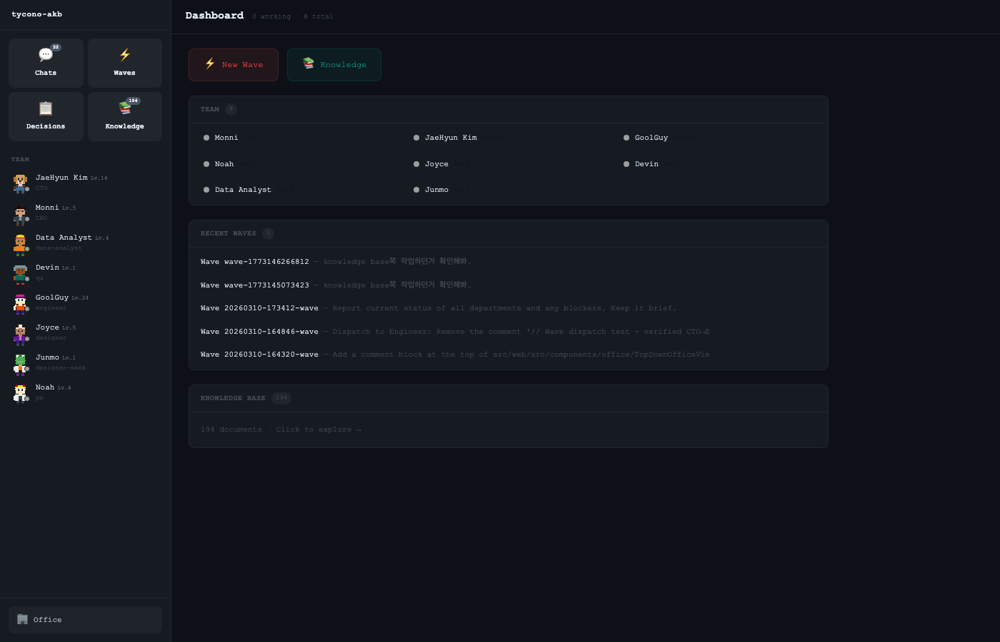

# tycono

AI Team Orchestration Engine

> Infrastructure-as-Code defines servers with a single YAML file.
> Company-as-Code defines an entire organization in code — and AI runs it.

<p align="center">
  <a href="https://www.npmjs.com/package/tycono"></a>
  <a href="https://www.npmjs.com/package/tycono-server"></a>
  <a href="https://github.com/seongsu-kang/tycono/blob/main/LICENSE"></a>
</p>

### Real-World Results

A crypto trading research team ran **13.5 hours of autonomous AI research** with zero human intervention:

| Metric | Value |
|--------|-------|
| Duration | 13.5 hours, 0 human input |
| Sessions | 174 agent sessions |
| Hypotheses tested | 29 |
| Cost | **$54 total ($2.5/hypothesis)** |
| Critic catches | Prevented false-positive from reaching production |

Cost comparison: Solo agent $50/task vs Tycono **$4/wave** (down from $1,342 during beta).

---

## Philosophy

### Company as Code

Define organizational structure, roles, authorities, and knowledge scopes in plain files. AI agents operate within this structure autonomously.

```yaml
# role.yaml
id: engineer
name: "Alex"
level: member
reports_to: cto
model: claude-sonnet-4

authority:
  autonomous:
    - "Code implementation"
    - "Bug fixes"
  requires_approval:
    - "Architecture changes"

knowledge_scope:
  readable: ["projects/", "architecture/"]
  writable: ["projects/*/technical/"]
```

One file defines who the agent is, what they can do, what they know, and who they report to.

Vision: `tycono deploy company.yaml` — deploy a company with one command.

### Knowledge That Compounds

Every AI tool resets when the session ends. Tycono doesn't.

The **Agentic Knowledge Base (AKB)** is a file-based knowledge system where insights persist, compound, and cross-link over time.

```
1. Pre-K    Read existing knowledge before starting
2. Task     Define work from what the org already knows
3. Execute  Do the actual work
4. Post-K   Extract insights, cross-link, register in Hub
5. Next     Update status, identify next work
```

Session 50 is dramatically smarter than Session 1.

### Multi-Agent Supervision

Not a black box. You watch the entire hierarchy work in real time.

```
dispatch   CEO assigns CTO. CTO assigns Engineer.
watch      Heartbeat monitors progress in real time.
react      If direction drifts, supervisor sends amend.
repeat     Until the wave is complete.
```

Authority is enforced — engineers can't make CEO decisions, PMs can't merge code.

---

## Key Features (v0.1.0)

### Auto-Amend — 70% cost reduction

When a subordinate needs follow-up work, Tycono automatically continues the existing session instead of creating an expensive new one. A Haiku classifier decides whether each dispatch is a follow-up (amend) or genuinely new work (dispatch).

### Dispatch Protocol

Fire-and-forget async dispatch with real-time supervision. `dispatch:start` and `dispatch:done` events flow between parent and child sessions. Supervisors use heartbeat watch for progress monitoring.

### Handoff Summary

When the same role is re-dispatched, previous session results are automatically injected into the new context. No starting from scratch.

### Prompt Caching

System prompt sections are tagged as cacheable/dynamic. Static sections (role definition, skills, org structure) get `cache_control` for up to 90% input cost reduction on the Direct API runner.

### Active Wave Guard

Server shutdown checks for running waves before killing. Non-interactive environments block concurrent wave launches. Prevents data loss from accidental server kills.

### Critic Role

A Devil's Advocate role that challenges team conclusions. In production, a Critic caught a false-positive test result that would have been deployed, and blocked a diminishing-returns research loop.

---

## Surfaces

One engine, three interfaces.

### Plugin (Claude Code)

Install the plugin and run AI teams directly inside Claude Code.

```bash
claude plugin install tycono
/tycono "Build a landing page"
/tycono --agency gamedev "Build a tower defense"
```

### TUI (Terminal)

Terminal-native dashboard with multi-wave workspaces, real-time agent streams, and org tree visualization.

```bash
npx tycono
```

```
┌── W1 Build the API ──────┬── Stream  Docs  Info ──────────────┐
│  3 sessions               │  cto     → dispatch engineer       │
│  ── Org Tree ──           │  engineer → Write src/api/routes.ts│
│  ● CEO                    │  engineer  Write src/api/types.ts  │
│  ├─ ● CTO               │  qa       ▶ Running test suite...   │
│  │  ├─ ● engineer         │                                     │
│  │  └─ ● qa               │                                     │
│  └─ ○ CBO                │                                     │
└───────────────────────────┴─────────────────────────────────────┘
```

### Pixel (Web Dashboard)

Isometric pixel office visualization. Watch your AI team walk around, sit at desks, and collaborate visually.

**Coming Soon** at [tycono.ai](https://tycono.ai)

<p align="center">
  
</p>

---

## Agencies

Pre-built team configurations for common workflows.

```bash
/tycono --agency gamedev "Build a browser game"
/tycono --agency saas "Build an MVP for our SaaS"
/tycono --agency research "Analyze competitor landscape"
```

Browse all agencies at [tycono.ai/agencies](https://tycono.ai/agencies)

---

## Quick Start

```bash
mkdir my-company && cd my-company
npx tycono
```

A setup wizard guides you through naming your company, choosing a team template, and starting work.

### Requirements

- Node.js >= 18
- [Claude Code CLI](https://claude.ai/download) (recommended) or Anthropic API key

---

## Project Structure

This is a monorepo:

```
tycono/
├── src/
│   ├── api/              ← Core Engine (tycono server)
│   ├── tui/              ← TUI (terminal interface)
│   └── web/              ← Pixel (original web UI)
├── packages/
│   ├── server/           ← npm: tycono-server
│   ├── plugin/           ← Claude Code Plugin
│   └── web/              ← Agency Hub (tycono.ai)
├── .github/assets/       ← Screenshots
└── README.md
```

### Your Company Structure

When you run `npx tycono`, it scaffolds:

```
your-company/
├── CLAUDE.md             ← AI operating rules
├── roles/                ← AI role definitions (role.yaml + skills)
├── projects/             ← Product specs, PRDs, and tasks
├── architecture/         ← Technical decisions and designs
├── knowledge/            ← Domain knowledge (compounds over time)
└── .tycono/              ← Config and preferences
```

---

## CLI

```bash
npx tycono                # Start TUI (default)
npx tycono ./my-company   # Start with specific directory
npx tycono --classic      # Pixel office web UI
npx tycono --attach       # Connect to running API server
npx tycono --help         # Show help
```

## TUI Commands

```
Type naturally to talk to your AI team.

/new [text]       Create new wave
/waves            List all waves
/focus <n>        Switch to wave n
/agents           Wave → Role → Session tree
/sessions         Sessions + ports
/kill <id>        Kill a session
/docs             Files created in this wave
/read <path>      Preview file content
/open <path>      Open in $EDITOR
Tab               Panel Mode (org tree + stream + docs)
/quit             Exit
```

---

## Screenshots

<p align="center">
  
  <br><sub>Multi-wave workspace with real-time agent streams</sub>
</p>

<p align="center">
  
  <br><sub>Knowledge graph visualization</sub>
</p>

<p align="center">
  
  <br><sub>Pro view with detailed agent activity</sub>
</p>

---

## Development

```bash
git clone https://github.com/seongsu-kang/tycono.git
cd tycono
npm install
cd src/api && npm install && cd ../..
cd src/web && npm install && cd ../..

# Dev mode (hot reload)
npm run dev
```

## Links

- Website: [tycono.ai](https://tycono.ai)
- Agencies: [tycono.ai/agencies](https://tycono.ai/agencies)
- npm: [tycono-server](https://www.npmjs.com/package/tycono-server)
- GitHub: [seongsu-kang/tycono](https://github.com/seongsu-kang/tycono)
- License: [MIT](LICENSE)
